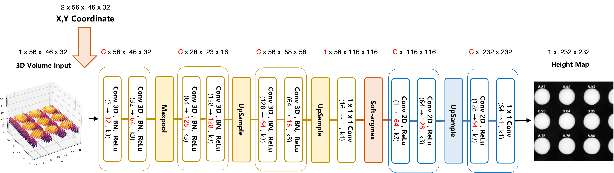

# End-to-End Deep Learning Framework for 3D Morphological Reconstruction and Height Estimation of Micro-Bumps

by Chaeyoung Lee, Seungmi Oh, Yujin Jang, and Jeongtae Kim

---

## Abstract
As the semiconductor industry advances toward high-density 3D packaging, the precise inspection of micro-bump height and coplanarity has become critical for ensuring production yield and device reliability. Existing metrology solutions typically present a trade-off between inspection speed and accuracy. For instance, white-light interferometry offers high precision but suffers from low measurement throughput, whereas optical triangulation enables rapid inline scanning but is susceptible to substantial specular reflections and structural distortion. Although previous studies have introduced statistical post-processing methods, such as Maximum a Posteriori (MAP) estimation, to suppress this noise, these methods often face limitations regarding hyperparameter dependency and edge over-smoothing. 

To address these limitations, we propose a deep learning framework for high-speed, fully morphological 3D bump reconstruction and precise height estimation. Our architecture utilizes a 3D Convolutional Neural Network (CNN) integrated with Coordinate Convolution (CoordConv) and a Soft-argmax block. This design translates noisy optical triangulation data into accurate, sub-pixel 3D profiles while compensating for position-dependent optical artifacts. Experimental results demonstrate that the proposed framework achieves high repeatability of the measurements across multiple scans, satisfying the inspection throughput required for inline manufacturing while maintaining accuracy comparable to conventional interferometry.

---

## Getting Started

### 1. Dataset Download
<details>
<summary><b>Click to expand Dataset Details</b></summary>

*(The dataset download link and instructions will be updated upon paper publication.)*
</details>

### 2. Environment Settings
<details>
<summary><b>Click to expand Environment Setup Instructions</b></summary>

- **OS**: Ubuntu 20.04.1 LTS
- **Language**: Python 3.8.10
- **Dependencies**: Listed in `requirements.txt`

```bash
# Clone the repository
git clone [https://github.com/chay-lee/Bump_deep_code.git](https://github.com/chay-lee/Bump_deep_code.git)
mv Bump_deep_code codes
cd codes

# Create and activate a virtual environment
# Option A: using virtualenv
python3 -m venv venv
source venv/bin/activate
python3 -m pip install -U -r requirements.txt

# Option B: using pipenv
pipenv install Pipfile
pipenv shell

Network Architecture
We propose an end-to-end deep learning framework designed for joint 3D topographic reconstruction and precise height estimation of micro-bumps. Our architecture utilizes a 3D Convolutional Neural Network (CNN) integrated with Coordinate Convolution (CoordConv) to compensate for position-dependent optical artifacts, a Soft-argmax block to probabilistically compress 3D feature maps into a continuous 2D height representation at sub-pixel precision, and a 2D CNN refiner to rectify spatial discontinuities and map values into absolute physical units.



Quantitative Results
(Quantitative evaluation results and tables will be updated soon.)

Credits
We established the Maximum a Posteriori (MAP) estimation-based metrology pipeline as our primary statistical baseline for comparative analysis.

This repository contains our independent implementation of the joint 3D CNN, CoordConv layers, and Soft-argmax projection blocks tailored for wafer-level micro-bump metrology.

License
This project is licensed under the MIT License - see the LICENSE file for details.