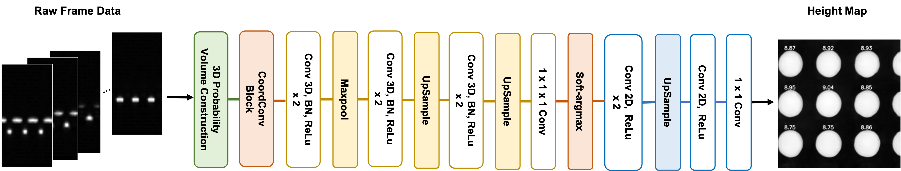

# 3D coordinate-aware deep learning for estimating heights of micro-bumps from projections

by Chaeyoung Lee, Seungmi Oh, Yujin Jang, and Jeongtae Kim

---

## Abstract

In advanced semiconductor packaging, micro-bumps serve as electrical and thermal interconnects between stacked dies, making precise height inspection critical for structural and functional reliability. High-precision metrology methods can provide accurate height measurements but often face limitations in inspection speed, whereas optical triangulation enables rapid inspection but is susceptible to optical noise and position-dependent measurement errors. To alleviate the problems of optical triangulation based methods, a previous study applied maximum a posteriori (MAP) estimation with a quadratic smoothness constraint, but yielded only limited improvement as blurred bump boundaries and position-dependent errors remain. To address these limitations, we propose an end-to-end convolutional neural network (CNN)-based deep learning system that utilizes a 3D CNN to refine the probability distribution of heights with coordinate information for suppressing optical noise and compensating for the position-dependent error, followed by a differentiable soft-argmax block and a 2D CNN for accurate height estimates. In experiments using real coin-bump data, the proposed system yielded more accurate height maps and bump peak height estimates as well as improved scan-to-scan repeatability.

---

## Getting Started

<details>
<summary><b>Dataset Download</b></summary>

The **Coin Bump Dataset** used in this study is available on Zenodo.

**DOI:** https://doi.org/10.5281/zenodo.21834980

The dataset includes optical triangulation measurements and corresponding CSI ground-truth height maps of semiconductor coin bumps.

```bash
unzip Coin_bump_dataset.zip
```

</details>

<details>
<summary><b>Environment Settings</b></summary>

- **OS**: Ubuntu 20.04.1 LTS
- **Language**: Python 3.8.10
- **Dependencies**: Listed in `requirements.txt`

```bash
# Clone the repository
git clone https://github.com/chay-lee/Bump_deep_code.git
cd Bump_deep_code

# Create and activate a virtual environment
python3 -m venv venv
source venv/bin/activate
python3 -m pip install -U -r requirements.txt
```
</details>

<details>
<summary><b>Train and Evaluate</b></summary>

The training and evaluation scripts can be run through `run.sh`.

Before running the code, set `DATASET_PATH` in `run.sh` to the root directory of the extracted Coin Bump Dataset.

```bash
DATASET_PATH="./data"
```

The default configuration in `run.sh` corresponds to **Proposed ($L_r + L_c + L_t$)** reported in the paper.

Train the model with:

```bash
bash run.sh train
```

Evaluate the trained model on the repeated test scans with:

```bash
bash run.sh test
```

Alternatively, run training followed by evaluation with:

```bash
bash run.sh all
```

The main experimental settings can be modified directly in `run.sh`, including the random seed, loss weights (`LAMBDA_C`, `LAMBDA_T`), learning rate, number of epochs, batch size, CoordConv, and the 2D CNN refiner.

</details>

---

## Network Architecture

The proposed system processes the 3D probability volume constructed from scan projections through a multi-stage pipeline designed to mitigate optical noise and position-dependent errors. Specifically, a 3D CNN estimates refined probability volume features and a soft-argmax block converts the refined feature volume into height estimates, then a final 2D CNN further refines these estimates using neighboring spatial information.



---
## Results

The proposed system is evaluated in terms of pixel-wise reconstruction accuracy ($E_p$), bump peak height accuracy ($E_b$), and scan-to-scan repeatability ($\sigma_p$, $\sigma_b$).

### Quantitative Results

> **Note:** All metrics are expressed in $10^{-2}~\mu\text{m}$. Bold text indicates optimal performance. Values are presented as mean ± standard deviation across three distinct random seeds.

| Method | $E_p$ (Pixel MAE) | $\sigma_p$ (Pixel STD) | $E_b$ (Bump Bias) | $\sigma_b$ (Bump STD) |
| :--- | :---: | :---: | :---: | :---: |
| **MAP** | 164.67 | 7.72 | 6.64 | 5.75 |
| **Proposed ($L_r$)** | **17.89 ± 0.28** | 8.04 ± 0.22 | 6.50 ± 0.95 | 4.79 ± 0.21 |
| **Proposed ($L_r + L_c$)** | 20.94 ± 0.57 | 7.73 ± 0.27 | 7.75 ± 0.31 | 4.35 ± 0.08 |
| **Proposed ($L_r + L_c + L_t$)** | 20.29 ± 0.44 | **6.69 ± 0.05** | **5.65 ± 0.76** | **4.28 ± 0.04** |
| **Proposed (w/o CoordConv)** | 37.02 ± 0.12 | 9.95 ± 0.37 | 25.46 ± 1.07 | 5.14 ± 0.05 |
| **Proposed (w/o 2D CNN)** | 23.46 ± 0.25 | 6.76 ± 0.17 | 12.47 ± 0.45 | 5.03 ± 0.15 |

---

## Credits

The coin bump test wafer used for data acquisition was provided by ATI.

We established the Maximum a Posteriori (MAP) estimation-based metrology pipeline as our primary statistical baseline for comparative analysis.

This repository contains our independent implementation of the joint 3D CNN, CoordConv layers, and Soft-argmax projection blocks tailored for wafer-level micro-bump metrology.

---

## License

This project is licensed under the [MIT License](LICENSE)
```
